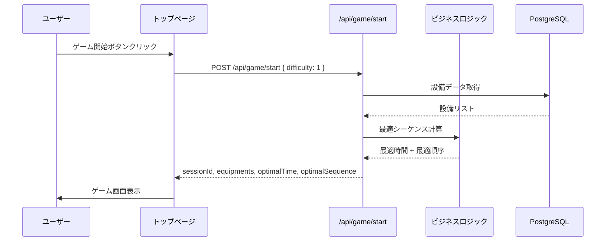
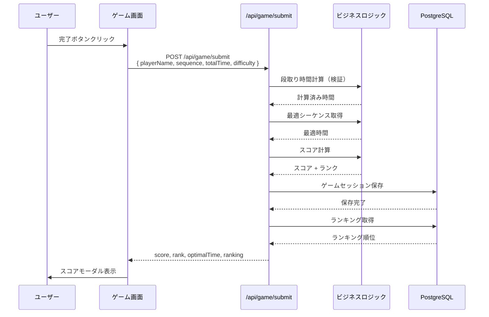
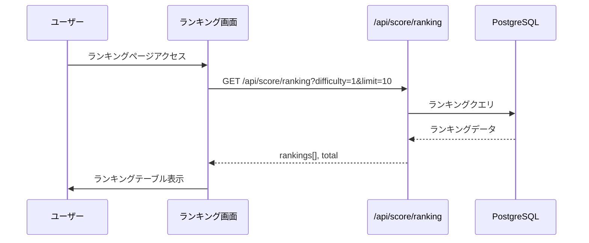

# システム構成図

## 概要

このドキュメントは、製造業向け段取りシミュレーションゲームのシステムアーキテクチャを記述します。

## システム全体図

```mermaid
graph TB
    subgraph "クライアント（ブラウザ）"
        A[React Components]
        B[Zustand Store]
        C[@dnd-kit]
        A --> B
        A --> C
    end

    subgraph "Next.js 14 App Router"
        D[Pages<br/>/, /game, /ranking]
        E[API Routes<br/>/api/game/*, /api/score/*]
        D --> E
    end

    subgraph "ビジネスロジック"
        F[lib/utils<br/>段取り最適化アルゴリズム]
        G[lib/db<br/>Prisma Client]
        E --> F
        E --> G
    end

    subgraph "データベース"
        H[(PostgreSQL<br/>Supabase)]
        G --> H
    end

    subgraph "デプロイ環境"
        I[Vercel<br/>CDN + Serverless Functions]
        D --> I
        E --> I
    end

    A --> D
    I --> H
```

## レイヤー構造

```mermaid
graph TD
    subgraph "プレゼンテーション層"
        A1[Pages<br/>トップ、ゲーム、ランキング]
        A2[Components<br/>UI部品、ゲーム部品]
        A3[Styles<br/>TailwindCSS]
    end

    subgraph "状態管理層"
        B1[Zustand Store<br/>ゲーム状態、UI状態]
    end

    subgraph "API層"
        C1[/api/game/start<br/>ゲーム開始]
        C2[/api/game/submit<br/>ゲーム完了]
        C3[/api/score/ranking<br/>ランキング取得]
    end

    subgraph "ビジネスロジック層"
        D1[段取り最適化<br/>巡回セールスマン問題]
        D2[スコア計算<br/>ランク判定]
        D3[段取り時間計算]
    end

    subgraph "データアクセス層"
        E1[Prisma Client<br/>ORM]
    end

    subgraph "データ永続化層"
        F1[(PostgreSQL)]
    end

    A1 --> B1
    A1 --> C1
    A1 --> C2
    A1 --> C3
    A2 --> B1
    C1 --> D1
    C1 --> E1
    C2 --> D1
    C2 --> D2
    C2 --> D3
    C2 --> E1
    C3 --> E1
    E1 --> F1
```

## 技術スタック

### フロントエンド

| 技術 | バージョン | 選定理由 |
|------|-----------|---------|
| **Next.js** | 14.2.20 | App Router採用、SSR/SSG対応、ゼロコンフィグ |
| **React** | 18.3.1 | UIライブラリのデファクトスタンダード |
| **TypeScript** | 5.7.3 | 型安全性、開発効率向上 |
| **TailwindCSS** | 3.4.17 | ユーティリティファースト、高速開発 |
| **@dnd-kit** | 6.3.1 | モダンなドラッグ&ドロップライブラリ |
| **framer-motion** | 12.29.0 | スムーズなアニメーション |
| **react-hot-toast** | 2.6.0 | トースト通知 |

### 状態管理

| 技術 | バージョン | 選定理由 |
|------|-----------|---------|
| **Zustand** | 5.0.10 | シンプル、軽量、Reactに最適化 |

### バックエンド・データベース

| 技術 | バージョン | 選定理由 |
|------|-----------|---------|
| **Prisma** | 5.22.0 | モダンなORM、型安全、マイグレーション管理 |
| **PostgreSQL** | 最新 | リレーショナルDB、ACID準拠 |
| **Supabase** | - | PostgreSQL ホスティング、認証サービス（将来） |

### デプロイ

| 技術 | バージョン | 選定理由 |
|------|-----------|---------|
| **Vercel** | 最新 | Next.js最適化、ゼロコンフィグデプロイ、CDN |

### 開発ツール

| 技術 | バージョン | 選定理由 |
|------|-----------|---------|
| **ESLint** | 8.57.0 | コード品質チェック |
| **PostCSS** | 8.4.49 | CSS変換ツール |
| **Autoprefixer** | 10.4.20 | ベンダープレフィックス自動付与 |
| **tsx** | 4.21.0 | TypeScriptスクリプト実行 |

## ディレクトリ構造

```
manufacturing-setup-simulator/
├── src/
│   ├── app/                          # Next.js App Router
│   │   ├── api/                      # APIルート
│   │   │   ├── game/                 # ゲーム関連API
│   │   │   │   ├── start/
│   │   │   │   │   └── route.ts     # POST /api/game/start
│   │   │   │   ├── submit/
│   │   │   │   │   └── route.ts     # POST /api/game/submit
│   │   │   │   ├── calculate-time/
│   │   │   │   │   └── route.ts     # POST /api/game/calculate-time
│   │   │   │   └── hint/
│   │   │   │       └── route.ts     # POST /api/game/hint
│   │   │   └── score/                # スコア関連API
│   │   │       └── ranking/
│   │   │           └── route.ts     # GET /api/score/ranking
│   │   ├── game/                     # ゲーム画面
│   │   │   └── page.tsx             # /game
│   │   ├── ranking/                  # ランキング画面
│   │   │   └── page.tsx             # /ranking
│   │   ├── layout.tsx                # ルートレイアウト
│   │   ├── page.tsx                  # トップページ（/）
│   │   └── globals.css               # グローバルCSS
│   │
│   ├── components/                   # Reactコンポーネント
│   │   ├── ui/                       # 共通UIコンポーネント
│   │   │   ├── Button.tsx
│   │   │   ├── Modal.tsx
│   │   │   └── Toast.tsx
│   │   └── game/                     # ゲーム関連コンポーネント
│   │       ├── EquipmentList.tsx    # 設備リスト
│   │       ├── EquipmentCard.tsx    # 設備カード
│   │       ├── SetupTimeDisplay.tsx # 段取り時間表示
│   │       └── ScoreModal.tsx       # スコアモーダル
│   │
│   ├── lib/                          # ユーティリティ
│   │   ├── db/                       # データベース関連
│   │   │   └── prisma.ts            # Prismaクライアント
│   │   ├── types/                    # TypeScript型定義
│   │   │   └── index.ts             # 共通型定義
│   │   └── utils/                    # 汎用関数
│   │       └── index.ts             # 段取り最適化、スコア計算
│   │
│   └── store/                        # Zustand状態管理
│       └── gameStore.ts              # ゲーム状態
│
├── prisma/
│   ├── schema.prisma                 # データベーススキーマ
│   ├── migrations/                   # マイグレーションファイル
│   └── seed.ts                       # シードデータ
│
├── docs/                             # プロジェクトドキュメント
│   ├── design/                       # 設計ドキュメント
│   │   ├── DATABASE.md
│   │   ├── SCREENS.md
│   │   ├── ARCHITECTURE.md
│   │   └── API.md
│   ├── development/                  # 開発ドキュメント
│   │   ├── SETUP.md
│   │   └── TESTING.md
│   └── deployment/                   # デプロイドキュメント
│       └── VERCEL.md
│
├── public/                           # 静的ファイル
│   └── (images, icons, etc.)
│
├── .env.example                      # 環境変数テンプレート
├── .env.local                        # 環境変数（Git管理外）
├── .gitignore
├── next.config.ts                    # Next.js設定
├── package.json                      # 依存関係
├── tailwind.config.ts                # TailwindCSS設定
├── tsconfig.json                     # TypeScript設定
└── README.md                         # プロジェクト概要
```

## データフロー

### ゲーム開始フロー



### ゲーム完了フロー



### ランキング表示フロー



## 段取り最適化アルゴリズム

### 問題定義

製造現場において、複数の設備を使用する際、設備間の段取り替え時間を最小化する順序を見つける問題は、**巡回セールスマン問題（TSP: Traveling Salesman Problem）**の変種として捉えられます。

### アルゴリズム選択

| アルゴリズム | 時間計算量 | 最適解保証 | 実装難易度 | 採用理由 |
|-------------|-----------|-----------|-----------|---------|
| **動的計画法（Held-Karp）** | O(n² × 2ⁿ) | ✓ | 中 | **採用** 設備数が少ない（〜15）場合に最適 |
| 全探索（Brute Force） | O(n!) | ✓ | 低 | ✗ 設備数が増えると非現実的 |
| 貪欲法（Nearest Neighbor） | O(n²) | ✗ | 低 | ✗ 最適解保証なし |
| 2-opt法 | O(n²) × 反復回数 | ✗ | 中 | ✗ 最適解保証なし |

### 実装詳細（src/lib/utils/index.ts）

```typescript
/**
 * 動的計画法（Held-Karp）を使用して最適な設備順序を計算
 * 時間計算量: O(n² × 2ⁿ)
 */
export async function findOptimalSequence(): Promise<{
  sequence: string[]; // 最適な設備順序（設備ID配列）
  time: number;       // 最小段取り時間
}> {
  // 1. データベースから設備と段取りマトリクスを取得
  const equipments = await prisma.equipment.findMany();
  const setupMatrix = await prisma.setupMatrix.findMany();

  // 2. 段取り時間マトリクスを構築
  const timeMatrix = buildTimeMatrix(equipments, setupMatrix);

  // 3. 動的計画法で最適順序を計算
  const result = heldKarpTSP(timeMatrix, equipments);

  return result;
}
```

### パフォーマンス考慮事項

- **設備数の制限**: 15設備以下（2¹⁵ = 32,768 通り）
- **メモ化**: 部分問題の結果をキャッシュ
- **並列処理**: 将来的にWeb Workersで計算を分離

## スコアリングシステム

### スコア計算式

```typescript
score = 100 × (optimalTime / playerTime) × difficultyMultiplier × hintPenalty
```

| パラメータ | 説明 | 範囲 |
|-----------|------|------|
| optimalTime | 最適な段取り時間 | 正の整数 |
| playerTime | プレイヤーの段取り時間 | 正の整数 |
| difficultyMultiplier | 難易度ボーナス | 1.0〜1.5 |
| hintPenalty | ヒント使用ペナルティ | 1.0〜0.7 |

### ランク判定

| ランク | スコア範囲 | 説明 |
|-------|-----------|------|
| **S** | 95〜100 | 最適解に非常に近い |
| **A** | 85〜94 | 優秀な結果 |
| **B** | 70〜84 | 良好な結果 |
| **C** | 50〜69 | 改善の余地あり |
| **D** | 0〜49 | 要改善 |

## セキュリティ

### API保護

- **入力検証**: すべてのAPIエンドポイントで入力値を検証
- **SQLインジェクション対策**: Prisma ORMによるパラメータ化クエリ
- **XSS対策**: Reactの自動エスケープ
- **CSRF対策**: Next.jsのSameSite Cookie設定

### データ保護

- **環境変数**: 機密情報を`.env.local`で管理（Git管理外）
- **データベース接続**: TLS/SSL暗号化
- **API認証**: 将来的にSupabase Authを統合予定

## パフォーマンス最適化

### フロントエンド

- **コード分割**: Next.js動的インポート
- **画像最適化**: Next.js Image コンポーネント
- **CSS最適化**: TailwindCSS PurgeCSS
- **キャッシング**: SWR（将来）

### バックエンド

- **データベースインデックス**: 頻繁なクエリにインデックス追加
- **接続プーリング**: Prismaコネクションプール
- **クエリ最適化**: N+1問題の回避
- **サーバーレス関数**: Vercel Edge Functions（将来）

### デプロイ

- **CDN**: Vercel Edge Network
- **キャッシュ戦略**: 静的ファイルの永続キャッシュ
- **プリレンダリング**: トップページのSSG

## 監視・ログ

### エラー監視

- **console.error**: サーバーサイドエラーログ
- **Vercel Analytics**: パフォーマンス監視（将来）
- **Sentry**: エラートラッキング（将来）

### パフォーマンス監視

- **Vercel Analytics**: Core Web Vitals
- **Lighthouse**: CI/CD統合（将来）

## スケーラビリティ

### 水平スケーリング

- **Vercel**: 自動スケーリング（Serverless Functions）
- **Supabase**: データベース接続プーリング

### 垂直スケーリング

- **データベース**: Supabase Proプランへのアップグレード
- **計算リソース**: Vercel Enterpriseプランへのアップグレード

## 将来の拡張性

### Phase 2: 認証機能

- Supabase Auth統合
- ユーザープロフィール
- ソーシャルログイン（Google、GitHub）

### Phase 3: マルチプレイヤー

- リアルタイム対戦モード
- WebSocket（Supabase Realtime）

### Phase 4: 高度な分析

- プレイヤー行動分析
- カイゼン提案AI
- 学習曲線の可視化

## 技術選定の理由まとめ

### Next.js 14

- **App Router**: ファイルベースルーティング、レイアウト共有
- **SSR/SSG**: SEO最適化、初期表示高速化
- **API Routes**: バックエンド統合

### TypeScript

- **型安全性**: コンパイル時エラー検出
- **開発効率**: IDEサポート、リファクタリング容易

### Prisma

- **型安全**: TypeScript完全統合
- **マイグレーション**: スキーマ変更管理
- **開発体験**: Prisma Studio

### Zustand

- **シンプル**: Reduxより簡潔
- **軽量**: バンドルサイズ小
- **TypeScript**: 完全型サポート

### Vercel

- **Next.js最適化**: 開発元による最適化
- **ゼロコンフィグ**: デプロイ簡単
- **CDN**: グローバル配信
