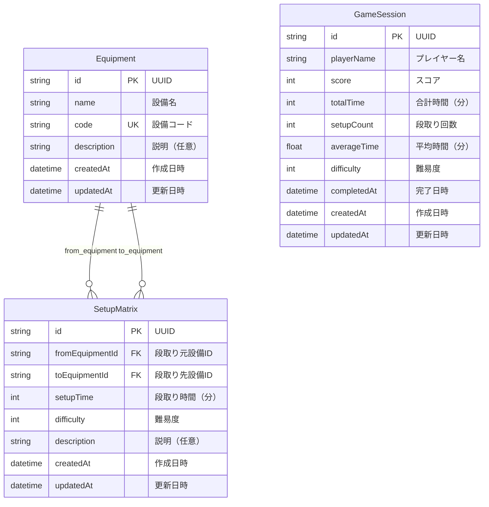

# データベース設計書

## 概要

このドキュメントは、製造業向け段取りシミュレーションゲームのデータベース設計を記述します。

## ER図



## テーブル定義

### Equipment（設備マスタ）

製造設備の情報を管理するテーブル。

| カラム名 | 型 | Null | デフォルト | 制約 | 説明 |
|---------|-----|------|-----------|------|------|
| id | String | NO | uuid() | PRIMARY KEY | 設備ID（UUID） |
| name | String | NO | - | - | 設備名 |
| code | String | NO | - | UNIQUE | 設備コード（一意） |
| description | String | YES | NULL | - | 設備の説明 |
| createdAt | DateTime | NO | now() | - | 作成日時 |
| updatedAt | DateTime | NO | now() | - | 更新日時 |

#### インデックス

- `code`: 設備コードによる高速検索

#### リレーション

- `setupMatrixFrom`: 段取り元設備として参照される段取りマトリクス（1対多）
- `setupMatrixTo`: 段取り先設備として参照される段取りマトリクス（1対多）

### SetupMatrix（段取りマトリクス）

設備間の段取り時間を管理するテーブル。設備A→設備Bへの切り替えにかかる時間を記録。

| カラム名 | 型 | Null | デフォルト | 制約 | 説明 |
|---------|-----|------|-----------|------|------|
| id | String | NO | uuid() | PRIMARY KEY | 段取りマトリクスID（UUID） |
| fromEquipmentId | String | NO | - | FOREIGN KEY (Equipment.id) | 段取り元設備ID |
| toEquipmentId | String | NO | - | FOREIGN KEY (Equipment.id) | 段取り先設備ID |
| setupTime | Int | NO | - | - | 段取り時間（分） |
| difficulty | Int | NO | 1 | - | 難易度（1-5） |
| description | String | YES | NULL | - | 段取りの説明 |
| createdAt | DateTime | NO | now() | - | 作成日時 |
| updatedAt | DateTime | NO | now() | - | 更新日時 |

#### インデックス

- `fromEquipmentId`: 段取り元設備IDによる検索
- `toEquipmentId`: 段取り先設備IDによる検索

#### ユニーク制約

- `(fromEquipmentId, toEquipmentId)`: 同じ設備間の段取りは1つのみ

#### リレーション

- `fromEquipment`: 段取り元設備（多対1、カスケード削除）
- `toEquipment`: 段取り先設備（多対1、カスケード削除）

### GameSession（ゲームセッション）

ゲームプレイの記録を管理するテーブル。

| カラム名 | 型 | Null | デフォルト | 制約 | 説明 |
|---------|-----|------|-----------|------|------|
| id | String | NO | uuid() | PRIMARY KEY | ゲームセッションID（UUID） |
| playerName | String | NO | - | - | プレイヤー名 |
| score | Int | NO | - | - | スコア（0-100） |
| totalTime | Int | NO | - | - | 合計段取り時間（分） |
| setupCount | Int | NO | 0 | - | 段取り回数 |
| averageTime | Float | YES | NULL | - | 平均段取り時間（分） |
| difficulty | Int | NO | 1 | - | 難易度（1-5） |
| completedAt | DateTime | NO | now() | - | 完了日時 |
| createdAt | DateTime | NO | now() | - | 作成日時 |
| updatedAt | DateTime | NO | now() | - | 更新日時 |

#### インデックス

- `completedAt`: 完了日時による検索（ランキング表示）
- `playerName`: プレイヤー名による検索
- `score`: スコアによる検索（ランキング表示）

## サンプルデータ

### Equipment（設備マスタ）

```sql
INSERT INTO "Equipment" (id, name, code, description) VALUES
  ('550e8400-e29b-41d4-a716-446655440001', '旋盤A', 'LATHE-A', '高精度汎用旋盤'),
  ('550e8400-e29b-41d4-a716-446655440002', '旋盤B', 'LATHE-B', '高速旋盤'),
  ('550e8400-e29b-41d4-a716-446655440003', 'フライス盤', 'MILL-A', 'NC フライス盤'),
  ('550e8400-e29b-41d4-a716-446655440004', 'ボール盤', 'DRILL-A', '縦型ボール盤'),
  ('550e8400-e29b-41d4-a716-446655440005', '研削盤', 'GRIND-A', '平面研削盤');
```

### SetupMatrix（段取りマトリクス）

```sql
-- 旋盤A → 他設備
INSERT INTO "SetupMatrix" (id, "fromEquipmentId", "toEquipmentId", "setupTime", difficulty, description) VALUES
  ('650e8400-e29b-41d4-a716-446655440001', '550e8400-e29b-41d4-a716-446655440001', '550e8400-e29b-41d4-a716-446655440002', 30, 1, '同種旋盤のため段取り短縮可能'),
  ('650e8400-e29b-41d4-a716-446655440002', '550e8400-e29b-41d4-a716-446655440001', '550e8400-e29b-41d4-a716-446655440003', 60, 2, '工具交換が必要'),
  ('650e8400-e29b-41d4-a716-446655440003', '550e8400-e29b-41d4-a716-446655440001', '550e8400-e29b-41d4-a716-446655440004', 45, 1, '標準的な段取り時間'),
  ('650e8400-e29b-41d4-a716-446655440004', '550e8400-e29b-41d4-a716-446655440001', '550e8400-e29b-41d4-a716-446655440005', 90, 3, '治具交換と調整が必要');

-- 旋盤B → 他設備
INSERT INTO "SetupMatrix" (id, "fromEquipmentId", "toEquipmentId", "setupTime", difficulty, description) VALUES
  ('650e8400-e29b-41d4-a716-446655440005', '550e8400-e29b-41d4-a716-446655440002', '550e8400-e29b-41d4-a716-446655440001', 35, 1, '同種旋盤のため段取り短縮可能'),
  ('650e8400-e29b-41d4-a716-446655440006', '550e8400-e29b-41d4-a716-446655440002', '550e8400-e29b-41d4-a716-446655440003', 55, 2, '工具交換が必要'),
  ('650e8400-e29b-41d4-a716-446655440007', '550e8400-e29b-41d4-a716-446655440002', '550e8400-e29b-41d4-a716-446655440004', 40, 1, '標準的な段取り時間'),
  ('650e8400-e29b-41d4-a716-446655440008', '550e8400-e29b-41d4-a716-446655440002', '550e8400-e29b-41d4-a716-446655440005', 85, 3, '治具交換と調整が必要');
```

### GameSession（ゲームセッション）

```sql
INSERT INTO "GameSession" (id, "playerName", score, "totalTime", "setupCount", "averageTime", difficulty) VALUES
  ('750e8400-e29b-41d4-a716-446655440001', '山田太郎', 95, 200, 4, 50.0, 1),
  ('750e8400-e29b-41d4-a716-446655440002', '佐藤花子', 88, 230, 4, 57.5, 1),
  ('750e8400-e29b-41d4-a716-446655440003', '鈴木一郎', 92, 215, 4, 53.75, 1),
  ('750e8400-e29b-41d4-a716-446655440004', '田中美咲', 78, 280, 4, 70.0, 2),
  ('750e8400-e29b-41d4-a716-446655440005', '高橋健太', 85, 250, 4, 62.5, 2);
```

## データ整合性

### 外部キー制約

1. **SetupMatrix.fromEquipmentId → Equipment.id**
   - カスケード削除: 設備が削除されると、関連する段取りマトリクスも削除される
   - 理由: 設備が存在しない場合、段取り時間の情報は無意味

2. **SetupMatrix.toEquipmentId → Equipment.id**
   - カスケード削除: 設備が削除されると、関連する段取りマトリクスも削除される
   - 理由: 設備が存在しない場合、段取り時間の情報は無意味

### ビジネスルール

1. **SetupMatrix.setupTime**: 正の整数である必要がある
2. **SetupMatrix.difficulty**: 1-5の範囲である必要がある
3. **GameSession.score**: 0-100の範囲である必要がある
4. **GameSession.difficulty**: 1-5の範囲である必要がある
5. **Equipment.code**: 一意である必要がある（重複する設備コードは許可されない）

## パフォーマンス考慮事項

1. **Equipment.code にインデックス**: 設備コードによる検索の高速化
2. **SetupMatrix.fromEquipmentId, toEquipmentId にインデックス**: 段取り時間計算の高速化
3. **GameSession.score, completedAt にインデックス**: ランキング表示の高速化

## データベースマイグレーション

### 初期セットアップ

```bash
# Prismaクライアント生成
npx prisma generate

# データベースマイグレーション
npx prisma migrate dev --name init

# サンプルデータ投入（オプション）
npx prisma db seed
```

### Prisma Studio（データベースGUI）

```bash
npx prisma studio
```

ブラウザで [http://localhost:5555](http://localhost:5555) を開いて、データベースの内容を確認・編集できます。

## バックアップとリストア

### バックアップ（PostgreSQL）

```bash
pg_dump -h localhost -U username -d manufacturing_db -F c -b -v -f backup.dump
```

### リストア（PostgreSQL）

```bash
pg_restore -h localhost -U username -d manufacturing_db -v backup.dump
```

## 将来の拡張性

将来的に以下の拡張が検討されています：

1. **ユーザー認証テーブル**: Supabase Authとの統合
2. **製品テーブル**: 設備と製品の紐付け
3. **作業履歴テーブル**: 詳細な作業履歴の記録
4. **設備グループテーブル**: 設備のカテゴリ分類
