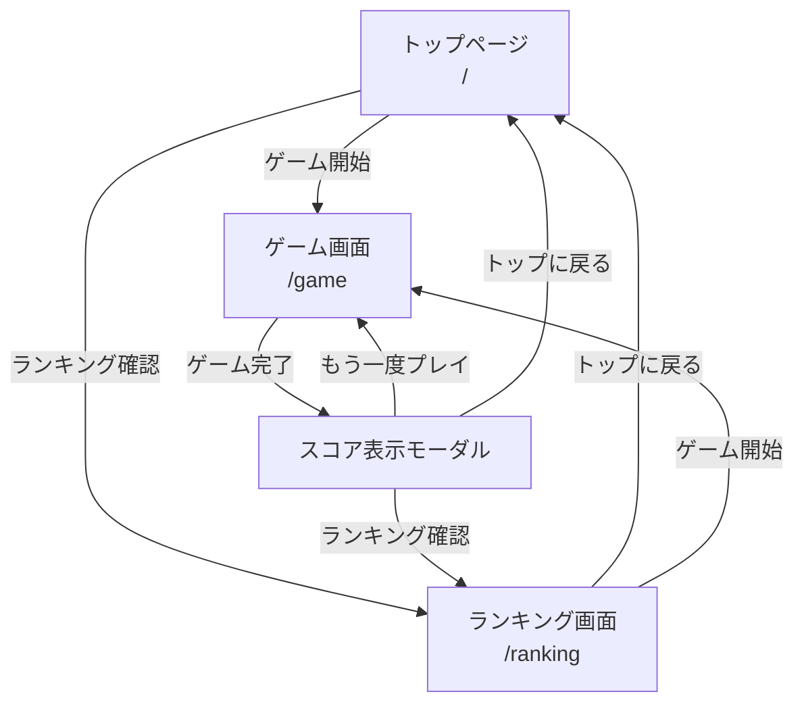

# 画面設計書

## 概要

このドキュメントは、製造業向け段取りシミュレーションゲームの画面設計を記述します。

## 画面遷移図



## 画面一覧

### 1. トップページ（/）

#### 目的

- アプリケーションのエントリーポイント
- ゲームの説明と開始

#### 表示内容

- **ヘッダー**
  - アプリケーションタイトル: 「製造業向け段取りシミュレーションゲーム」
  - サブタイトル: 「製造現場の段取り時間最適化を学ぶシミュレーションゲーム」

- **メインコンテンツ**
  - ゲームの特徴（箇条書き）
    - リアルタイムでの段取り時間の可視化
    - 様々な製品の切り替え（段取り替え）シミュレーション
    - 段取り時間削減によるコスト削減効果の学習
    - ゲーム感覚で製造現場のカイゼンを体験
  - 難易度選択ボタン（1-5）
  - ゲーム開始ボタン（プライマリーボタン）
  - ランキング確認ボタン（セカンダリーボタン）

- **フッター**
  - 技術スタック情報
  - バージョン情報

#### 操作

- 難易度選択ボタンをクリック → 難易度が選択される（デフォルト: 1）
- ゲーム開始ボタンをクリック → ゲーム画面（/game）に遷移
- ランキング確認ボタンをクリック → ランキング画面（/ranking）に遷移

#### 遷移先

- `/game` - ゲーム画面
- `/ranking` - ランキング画面

#### ワイヤーフレーム

```
┌─────────────────────────────────────────────────┐
│ 🏭 製造業向け段取りシミュレーションゲーム        │
│    製造現場の段取り時間最適化を学ぶ             │
├─────────────────────────────────────────────────┤
│                                                 │
│  特徴:                                          │
│  ✓ リアルタイムでの段取り時間の可視化           │
│  ✓ 様々な製品の切り替えシミュレーション         │
│  ✓ 段取り時間削減によるコスト削減効果の学習     │
│  ✓ ゲーム感覚で製造現場のカイゼンを体験         │
│                                                 │
│  難易度選択:                                    │
│  [ 1 ] [ 2 ] [ 3 ] [ 4 ] [ 5 ]                │
│                                                 │
│  ┌──────────────────┐  ┌─────────────────┐     │
│  │ ゲーム開始       │  │ ランキング確認  │     │
│  └──────────────────┘  └─────────────────┘     │
│                                                 │
├─────────────────────────────────────────────────┤
│ Next.js 14 | TypeScript | TailwindCSS | v0.1.0 │
└─────────────────────────────────────────────────┘
```

---

### 2. ゲーム画面（/game）

#### 目的

- ゲームプレイの実行
- 設備の順序を最適化して段取り時間を最小化

#### 表示内容

- **ヘッダー**
  - 現在の合計段取り時間
  - タイマー（経過時間）
  - ヒントボタン
  - リセットボタン

- **メインコンテンツ**
  - 設備リスト（ドラッグ&ドロップ可能）
    - 設備コード（例: LATHE-A）
    - 設備名（例: 旋盤A）
    - 設備説明（ツールチップ表示）
  - 段取り時間の可視化
    - 各設備間の段取り時間を矢印で表示
    - 段取り時間の色分け（緑: 短い、黄: 中程度、赤: 長い）
  - 合計段取り時間の表示（リアルタイム更新）

- **フッター**
  - プレイヤー名入力フィールド
  - 完了ボタン（プライマリーボタン）
  - 戻るボタン（セカンダリーボタン）

#### 操作

- 設備をドラッグ&ドロップ → 順序を変更
- ヒントボタンをクリック → 最適な次の設備を表示（スコアペナルティあり）
- リセットボタンをクリック → 設備の順序を初期状態に戻す
- プレイヤー名を入力
- 完了ボタンをクリック → スコア計算してモーダル表示
- 戻るボタンをクリック → トップページ（/）に遷移

#### 遷移先

- モーダル表示（スコア表示）
- `/` - トップページ（戻るボタン）

#### ワイヤーフレーム

```
┌─────────────────────────────────────────────────┐
│ 段取り時間: 200分 | ⏱ 05:32 | [ヒント] [リセット] │
├─────────────────────────────────────────────────┤
│                                                 │
│  設備リスト（ドラッグ＆ドロップで並び替え）       │
│                                                 │
│  ┌──────────────┐                              │
│  │ 1. LATHE-A   │ 旋盤A                        │
│  │              │ → 30分 →                     │
│  └──────────────┘                              │
│  ┌──────────────┐                              │
│  │ 2. LATHE-B   │ 旋盤B                        │
│  │              │ → 55分 →                     │
│  └──────────────┘                              │
│  ┌──────────────┐                              │
│  │ 3. MILL-A    │ フライス盤                   │
│  │              │ → 45分 →                     │
│  └──────────────┘                              │
│  ┌──────────────┐                              │
│  │ 4. DRILL-A   │ ボール盤                     │
│  │              │ → 70分 →                     │
│  └──────────────┘                              │
│  ┌──────────────┐                              │
│  │ 5. GRIND-A   │ 研削盤                       │
│  └──────────────┘                              │
│                                                 │
│  合計段取り時間: 200分                          │
│                                                 │
│  プレイヤー名: [_______________]                │
│                                                 │
│  ┌──────────────┐  ┌─────────────────┐         │
│  │ 完了         │  │ 戻る            │         │
│  └──────────────┘  └─────────────────┘         │
│                                                 │
└─────────────────────────────────────────────────┘
```

---

### 3. ランキング画面（/ranking）

#### 目的

- 過去のプレイヤーのスコアを確認
- 自分のスコアと比較

#### 表示内容

- **ヘッダー**
  - タイトル: 「ランキング」
  - 難易度フィルター（1-5）

- **メインコンテンツ**
  - ランキングテーブル
    - 順位
    - プレイヤー名
    - スコア
    - 合計時間
    - 完了日時
  - ページネーション（10件ずつ表示）

- **フッター**
  - トップに戻るボタン
  - ゲーム開始ボタン

#### 操作

- 難易度フィルターを選択 → 該当難易度のランキングを表示
- ページネーションをクリック → 次/前のページを表示
- トップに戻るボタンをクリック → トップページ（/）に遷移
- ゲーム開始ボタンをクリック → ゲーム画面（/game）に遷移

#### 遷移先

- `/` - トップページ
- `/game` - ゲーム画面

#### ワイヤーフレーム

```
┌─────────────────────────────────────────────────┐
│ 🏆 ランキング                                    │
│ 難易度: [ 1 ] [ 2 ] [ 3 ] [ 4 ] [ 5 ]          │
├─────────────────────────────────────────────────┤
│                                                 │
│  ┌───┬──────────┬─────┬────────┬──────────┐   │
│  │順位│プレイヤー│スコア│合計時間│完了日時  │   │
│  ├───┼──────────┼─────┼────────┼──────────┤   │
│  │ 1 │山田太郎  │  95 │ 200分  │2024/01/15│   │
│  │ 2 │鈴木一郎  │  92 │ 215分  │2024/01/15│   │
│  │ 3 │佐藤花子  │  88 │ 230分  │2024/01/14│   │
│  │ 4 │高橋健太  │  85 │ 250分  │2024/01/13│   │
│  │ 5 │田中美咲  │  78 │ 280分  │2024/01/13│   │
│  │...│...       │ ... │  ...   │   ...    │   │
│  └───┴──────────┴─────┴────────┴──────────┘   │
│                                                 │
│  ページネーション: ← 1 2 3 4 5 →                │
│                                                 │
│  ┌──────────────┐  ┌─────────────────┐         │
│  │ トップに戻る │  │ ゲーム開始      │         │
│  └──────────────┘  └─────────────────┘         │
│                                                 │
└─────────────────────────────────────────────────┘
```

---

### 4. スコア表示モーダル

#### 目的

- ゲーム完了時のスコアと結果を表示
- 次のアクションを促す

#### 表示内容

- **モーダルヘッダー**
  - タイトル: 「ゲーム完了！」
  - ランク表示（S/A/B/C/D）

- **モーダルコンテンツ**
  - スコア（大きく表示）
  - 詳細情報
    - あなたの時間: XXX分
    - 最適時間: YYY分
    - ランキング: 全体N位
  - メッセージ（ランクに応じた励ましのメッセージ）

- **モーダルフッター**
  - もう一度プレイボタン
  - ランキング確認ボタン
  - トップに戻るボタン

#### 操作

- もう一度プレイボタンをクリック → ゲーム画面（/game）にリロード
- ランキング確認ボタンをクリック → ランキング画面（/ranking）に遷移
- トップに戻るボタンをクリック → トップページ（/）に遷移
- モーダル外をクリック or ESCキー → モーダルを閉じる

#### 遷移先

- `/game` - ゲーム画面（もう一度プレイ）
- `/ranking` - ランキング画面
- `/` - トップページ

#### ワイヤーフレーム

```
┌─────────────────────────────────────────────────┐
│                                                 │
│    ┌───────────────────────────────────┐        │
│    │ 🎉 ゲーム完了！                  │        │
│    │                                   │        │
│    │          ランク: A                │        │
│    │                                   │        │
│    │     スコア: 95                    │        │
│    │                                   │        │
│    │  あなたの時間: 200分              │        │
│    │  最適時間: 190分                  │        │
│    │  ランキング: 全体12位             │        │
│    │                                   │        │
│    │  素晴らしい結果です！             │        │
│    │  もう少しで最適解に到達できます。 │        │
│    │                                   │        │
│    │  ┌───────────┐ ┌──────────┐     │        │
│    │  │もう一度   │ │ランキング│     │        │
│    │  │プレイ     │ │確認      │     │        │
│    │  └───────────┘ └──────────┘     │        │
│    │                                   │        │
│    │  ┌───────────────────────┐       │        │
│    │  │ トップに戻る          │       │        │
│    │  └───────────────────────┘       │        │
│    │                                   │        │
│    └───────────────────────────────────┘        │
│                                                 │
└─────────────────────────────────────────────────┘
```

---

## レスポンシブデザイン

### ブレークポイント

| デバイス | サイズ | 備考 |
|---------|--------|------|
| モバイル | 〜640px | 1カラムレイアウト |
| タブレット | 641px〜1024px | 2カラムレイアウト |
| デスクトップ | 1025px〜 | 3カラムレイアウト（一部） |

### モバイル対応

- **トップページ**: ボタンを縦に配置
- **ゲーム画面**: 設備リストを縦スクロール、段取り時間表示を簡略化
- **ランキング画面**: テーブルを横スクロール可能に
- **モーダル**: 画面幅に合わせてリサイズ

## アクセシビリティ

### キーボード操作

- **Tab**: フォーカス移動
- **Enter/Space**: ボタンクリック
- **Arrow keys**: 設備の順序変更（ゲーム画面）
- **ESC**: モーダルを閉じる

### スクリーンリーダー対応

- すべてのインタラクティブ要素にaria-label追加
- フォームフィールドにlabel要素を使用
- モーダルにaria-modal属性を追加

### カラーコントラスト

- WCAG 2.1 AA基準に準拠
- テキストと背景のコントラスト比: 4.5:1以上

## UI/UXガイドライン

### カラーパレット

- **プライマリー**: `#3B82F6`（青）
- **セカンダリー**: `#10B981`（緑）
- **警告**: `#F59E0B`（オレンジ）
- **危険**: `#EF4444`（赤）
- **背景**: `#F9FAFB`（薄いグレー）
- **テキスト**: `#1F2937`（濃いグレー）

### タイポグラフィ

- **フォントファミリー**: Inter, system-ui, sans-serif
- **見出し1**: 2.5rem (40px), font-weight: 700
- **見出し2**: 2rem (32px), font-weight: 600
- **見出し3**: 1.5rem (24px), font-weight: 600
- **本文**: 1rem (16px), font-weight: 400
- **小文字**: 0.875rem (14px), font-weight: 400

### スペーシング

- **余白**: 8px, 16px, 24px, 32px, 48px, 64px
- **コンテナ最大幅**: 1280px
- **ボタン高さ**: 44px（モバイル）、40px（デスクトップ）

### アニメーション

- **トランジション時間**: 150ms（短い）、300ms（標準）、500ms（長い）
- **イージング**: ease-in-out
- **ドラッグ&ドロップ**: スムーズなアニメーション
- **モーダル**: フェードイン/アウト

## 技術仕様

### 使用コンポーネントライブラリ

- **@dnd-kit/core**: ドラッグ&ドロップ機能
- **@dnd-kit/sortable**: ソート可能なリスト
- **framer-motion**: アニメーション
- **react-hot-toast**: トースト通知

### 状態管理

- **Zustand**: グローバル状態管理
  - ゲーム状態（設備順序、合計時間、難易度）
  - UI状態（モーダル表示、ローディング）

### ルーティング

- **Next.js App Router**: ページルーティング
  - `/` - トップページ（src/app/page.tsx）
  - `/game` - ゲーム画面（src/app/game/page.tsx）
  - `/ranking` - ランキング画面（src/app/ranking/page.tsx）
